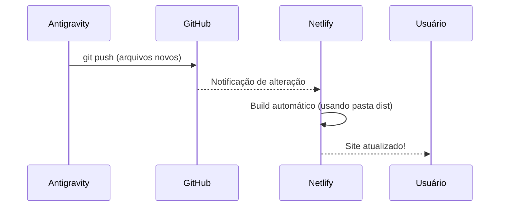
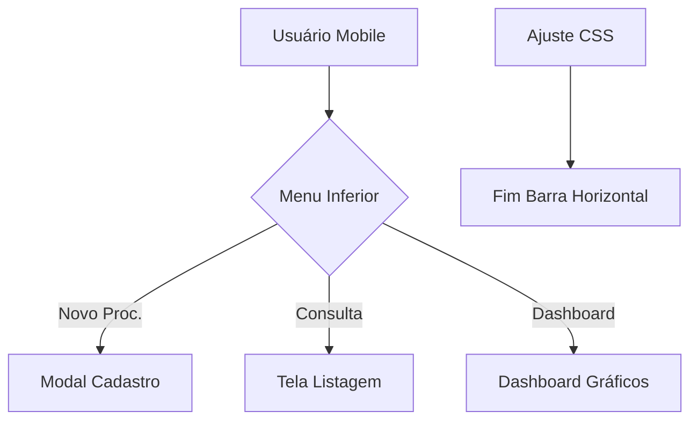

# Walkthrough de Correções Mobile e Layout

As correções para a experiência do usuário em smartphones foram aplicadas com sucesso.

## Alterações Realizadas

### 1. Navegação Mobile
- **Botão "Novo Proc."**: Corrigido para abrir o modal de cadastro de processo corretamente.
- **Menu Inferior**: Unificação de estilos para garantir que o menu fixo não oculte informações importantes.

### 2. Ajuste de Layout (Responsividade)
- **Barra de Rolagem Horizontal**: Eliminada através da aplicação de `overflow-x: hidden` no [html](file:///h:/2026%20SISTEMAS/2025%20Infra%20Sistemas%20YASMIN/index.html) e `body`.
- **Banner Institucional (SESME-C)**: Reposicionado para o centro e ajustado para não transbordar a largura da tela em dispositivos pequenos.
- **Viewport**: Garantia de que o sistema abra maximizado e adaptado à largura da tela do smartphone.

### 7. Deploy Automático (GitHub Sync)
Agora, para que o Netlify atualize sozinho quando você fizer alterações no GitHub:

1. No painel do Netlify, vá em **Site configuration** > **Build & deploy** > **Continuous Deployment**.
2. Clique em **Link a repository** e escolha seu GitHub.
3. Selecione o repositório `2026Infra` e a branch **`Infra2026`**.
4. Eu já enviei um arquivo chamado [netlify.toml](file:///h:/2026%20SISTEMAS/2025%20Infra%20Sistemas%20YASMIN/netlify.toml) que configurará tudo automaticamente (ele já sabe que deve usar a pasta `dist`).
5. Basta salvar e o Netlify fará o primeiro deploy automático!

