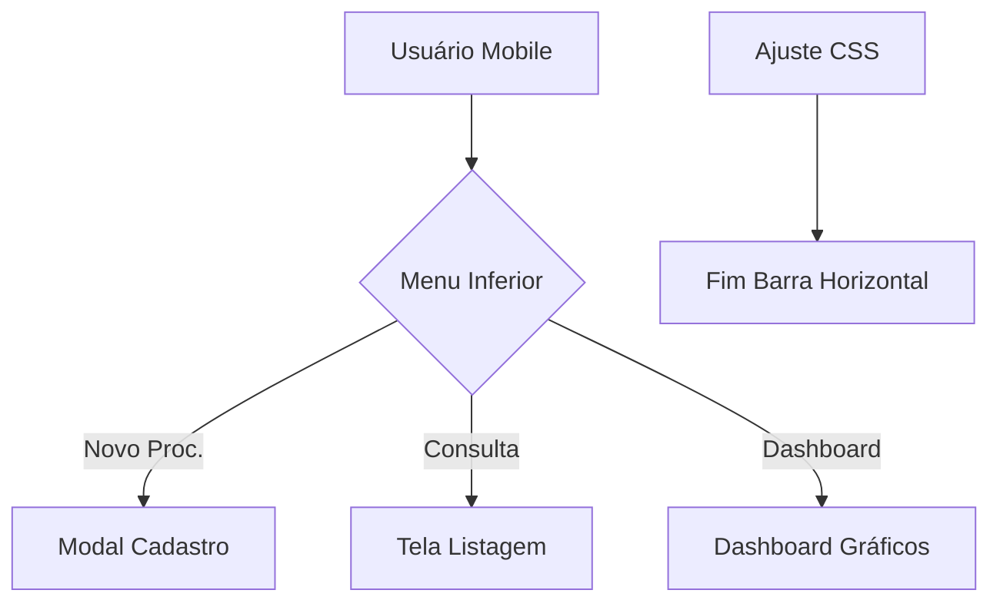

# Walkthrough de Correções Mobile e Layout

As correções para a experiência do usuário em smartphones foram aplicadas com sucesso.

## Alterações Realizadas

### 1. Navegação Mobile
- **Botão "Novo Proc."**: Corrigido para abrir o modal de cadastro de processo corretamente.
- **Menu Inferior**: Unificação de estilos para garantir que o menu fixo não oculte informações importantes.

### 2. Ajuste de Layout (Responsividade)
- **Barra de Rolagem Horizontal**: Eliminada através da aplicação de `overflow-x: hidden` no [html](file:///h:/2026%20SISTEMAS/2025%20Infra%20Sistemas%20YASMIN/index.html) e `body`.
- **Banner Institucional (SESME-C)**: Reposicionado para o centro e ajustado para não transbordar a largura da tela em dispositivos pequenos.
- **Viewport**: Garantia de que o sistema abra maximizado e adaptado à largura da tela do smartphone.

### 3. Distribuição
- **Pasta `dist`**: O arquivo [index.html](file:///h:/2026%20SISTEMAS/2025%20Infra%20Sistemas%20YASMIN/index.html) na pasta de distribuição foi atualizado com todas as melhorias.

## Como Verificar
1. No smartphone, recarregue o app (ou limpe o cache para garantir que o novo Service Worker carregue).
2. Tente rolar a página para o lado; a barra horizontal não deve mais aparecer.
3. Clique em **"Novo Proc."** no menu azul inferior; o modal de cadastro deve abrir imediatamente.

