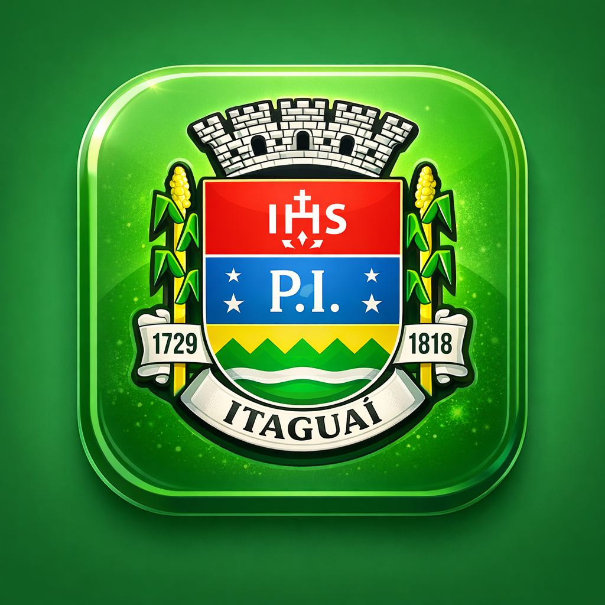

--- Accessibility ---

- Background and foreground colors do not have a sufficient contrast ratio. | ID: color-contrast | Score: 0
  [1] Snippet: <button class="btn btn-danger" onclick="window.exportDashboardToPDF()" style="color: rgb(255, 255, 255); width: 100px; height: 48px; border-radius: 10px;">

- Image elements do not have `[alt]` attributes | ID: image-alt | Score: 0
  [1] Snippet: 

--- SEO ---

- robots.txt is not valid | ID: robots-txt | Score: 0
  [1] Data: {"index":"1","line":"<!DOCTYPE html>","message":"Syntax not understood"}
  [2] Data: {"index":"2","line":"<html lang=\"pt-BR\">","message":"Syntax not understood"}
  [3] Data: {"index":"4","line":"<head>","message":"Syntax not understood"}
  [4] Data: {"index":"5","line":"    <meta charset=\"UTF-8\">","message":"Syntax not understood"}
  [5] Data: {"index":"6","line":"    <meta name=\"viewport\" content=\"width=device-width, initial-scale=1.0\">"

- Image elements do not have `[alt]` attributes | ID: image-alt | Score: 0
  [1] Snippet: 

--- Best Practices ---

- Uses third-party cookies | ID: third-party-cookies | Score: 0
  [1] URL: https://upload.wikimedia.org/wikipedia/commons/6/63/Bras%C3%A3o_de_Armas_de_Itagua%C3%AD.jpg

- Issues were logged in the `Issues` panel in Chrome Devtools | ID: inspector-issues | Score: 0
  [1] Data: {"issueType":"Cookie","subItems":{"type":"subitems","items":[{"url":"https://upload.wikimedia.org/wi
